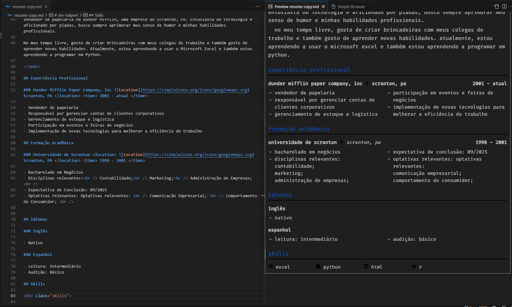

# Markdown Resume

Template de CV simples em Markdown. Para ser usado em conjunto com Preview do VSCode e a extensão 
[Markdown All in One](https://marketplace.visualstudio.com/items?itemName=yzhang.markdown-all-in-one).

[resume.css](./resume.css) contém a formatação do CV. 

|  |
|:--:|
| O corpo do possui largura e altura fixa com bordas para que seja possível visualizar como uma folha A4. |

## How to

- Clone o repositório e edite o arquivo [resume.md](./resume.md) pelo VSCode.
- Com a extensão Markdown All in One instalada, pressione Ctrl+Shift+P e digite "Markdown 
All in One: Print document to HTML". Isso irá renderizar o markdown em um arquivo HTML. 

Dica: habilite a opção ``markdown.extension.print.onFileSave`` para sempre gerar a versão HTML 
ao salvar o arquivo.

## Exportar para PDF

Abra o arquivo HTML no navegador e pressione Ctrl+P para imprimir e então salve como PDF.

## Warning

- a estrutura das listas estão bem freestyle, tente estilizar a estrutura do layout do jeito que 
achar melhor

## Preview output html from source

[GitHub Pages](https://jrmsrs.github.io/markdown-resume/preview)
